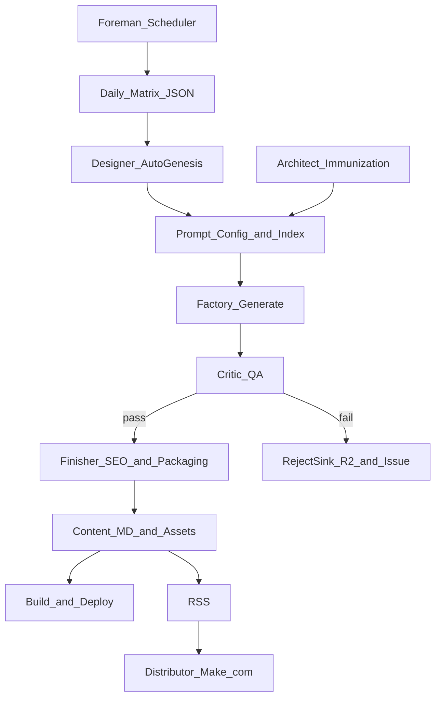

# Product Requirements Document (PRD): PaperPause Autonomy System (PRD vNext)

**Version:** 7.0

**Date:** December 21, 2025

**Status:** Draft (review-ready)

**Core stack:** Hugo, Cloudflare Pages, Cloudflare R2, Cloudflare Images, GitHub Actions, gemini-3-flash-preview (thinking + vision), gemini-3-pro-image-preview (image), Make.com
**Thinking model rules:** All reasoning/decision agents (0, 1, 3, 4) MUST use `gemini-3-flash-preview` with **Thinking Level: MEDIUM**.

**Companion docs:**
- Issues & Questions Log: `.docs/prd/autonomy-prd.issues.md`
- Agent Mapping (PRD roles ↔ repo): `.docs/prd/autonomy-prd.agent-mapping.md`
- Dependency & Rollout Map: `.docs/prd/autonomy-prd.rollout.md`

---

## 1) Executive summary

### Objective
Evolve PaperPause from a manually managed factory into an autonomous system that can reliably produce **5 → 50 assets/day** with **no human intervention required to complete the daily production run**.

### Non-negotiable constraints
- **Rollout safety**: every new capability ships with a clean “off switch” and a rollback path.
- **Idempotency**: reruns must not multiply content or corrupt existing content.
- **Budget control**: explicit ceilings per day and per collection, enforced by QA **fail-fast** and scheduling.
- **Auditability**: all decisions that reject/skip must be explainable via logs and issue records.

### Engineering guardrails (must follow)
All implementation work for this PRD must follow the repo’s architecture rules in `.ai-rules.md` (especially Hugo layout hierarchy and “no root `layouts/` edits”).

### Definition of “asset” (PRD default)
An **asset** (for “assets/day” counting) is an **Approved PNG** that has **passed QA** and is ready to be turned into a PDF (and published as a Hugo page by finishing).

If this definition changes, update `.docs/prd/autonomy-prd.issues.md` and re-baseline metrics.

---

## 2) Glossary
- **Category**: top-level bucket (e.g., `animals`) → `content/<category>/...`
- **Collection**: sub-bucket (e.g., `cats`) → `content/<category>/<collection>/...`
- **Matrix item**: unit of scheduling (typically `category/collection`)
- **Run**: one daily workflow execution
- **Survivor**: passes QA and is eligible for finishing/publishing
- **Rejected**: fails QA; routed to rejection sink + logged
- **Cap**: per-collection maximum post count; capped collections are excluded from scheduling

---

## 3) Architecture overview

The system is composed of:
- **Agents** (`.agents/*`): LLM/vision modules returning structured output (validated, retry-safe).
- **Tasks** (`scripts/morning-routine/tasks/*`): orchestration scripts (filesystem, Hugo, R2/CF, agent calls).

Concrete mapping to the current repo (what exists vs missing) lives in `.docs/prd/autonomy-prd.agent-mapping.md`.

---

## 4) State, artifacts, and schemas

### Repo artifacts (source of truth)
- **Content**: `content/<category>/<collection>/*.md`
- **Collection metadata**: `content/<category>/<collection>/_index.md`
- **Agents**: `.agents/<agent-name>/...`
- **Task entrypoints**: `scripts/morning-routine/tasks/*.ts`

### Run artifacts
- **Generation manifest**: `scripts/morning-routine/.runs/<runId>.json`
  - Current schema: `{ runId: string, created: string[] }` where `created` are repo-relative markdown paths.

### External storage (PRD target)
- **R2 originals**: stable key scheme, versioned (to avoid accidental breaking changes)
- **R2 rejected**: `rejected/<category>/<collection>/<...>`
- **Cloudflare Images**: optional; must always have an R2 fallback URL

### Issue ledgers (PRD target)
- **Trash Can (rejections)**: Issue #4
- **Run tracker (daily completion)**: keep Issue #1 (current workflow) unless intentionally consolidated
- **Note**: Issue #2 (Primary SEO Monitoring) exists as an external weekly reporting process but is **not part of the autonomy control loop** in this PRD. It may be integrated later as a separate enhancement.

All issue comment formats must be machine-parseable and versioned (see `.docs/prd/autonomy-prd.issues.md`).

---

## 5) Agent fleet (responsibilities + acceptance)

### Agent 0: Designer (Auto-Genesis)
- **Role**: ensure a scheduled collection has the minimal infrastructure to produce content.
- **Trigger**: pre-production (daily), per matrix item.
- **Inputs**: `category`, `collection`, rollout schedule context, brand rules.
- **Outputs**: prompt config + `_index.md` scaffolding within a bounded scope.
- **Invariants**: non-destructive; supports dry-run.
- **Disable switches**: `ENABLE_DESIGNER`, `DESIGNER_DRY_RUN`
- **Acceptance**: a newly scheduled collection no longer fails generation due to missing prompts or `_index.md`.
- **Model**: `gemini-3-flash-preview` (Thinking: MEDIUM).

### Agent 1: Architect (Immunization)
- **Role**: reduce failure rates by adjusting prompt configs based on rejection patterns.
- **Trigger**: weekly, not on the daily critical path.
- **Inputs**: Issue #4 (Trash Can) only.
- **Outputs**: bounded edits to prompt configs (e.g., `negative_prompt` updates).
- **Invariants**:
  - **Scope-limited mutation**: Agent 1 may only modify `negative_prompt` (or a dedicated `immunization_terms` list that is merged into `negative_prompt`). It must never change positive prompt text, templates, or subject/style lists.
  - **Capped edits**: bounded number of additions per collection per week; deduped terms; cooldown to avoid thrashing.
  - **Hard prompt budget (Agent 1 edits only)**: when editing `negative_prompt` via immunization, the **total Agent 1 input prompt** (Issue #4 context + reasoning + proposed edits) must be **≤ 500 characters** to stay within self-healing guardrails. This is a safety cap on the **feedback loop growth**, not on the full generation prompt.
    - If the cap would be exceeded, prune `immunization_terms` first (oldest-first / lowest-impact-first) until compliant.
    - If still > 500, abort the immunization change and log a warning (do not truncate positive prompt).
    - **Note**: The generation system's full prompt (base + styles + scene) may be much larger; the 500-char cap applies only to Agent 1's self-healing loop inputs.
  - **Reversible**: every change is git-revertable and logged.
  - **Deterministic parsing + schema versioning**: Issue #4 parsing must be stable and versioned.
- **Disable switches**: `ENABLE_IMMUNIZATION`, `IMMUNIZATION_MAX_EDITS_PER_RUN`
- **Acceptance**: targeted rejection reasons drop over N runs without introducing new dominant failures.
- **Model**: `gemini-3-flash-preview` (Thinking: MEDIUM).
- **Note**: Issue #2 (Primary SEO Monitoring) is not used as an input; it remains an external reporting process.

### Agent 2: Factory (Generation)
- **Role**: generate candidate images and draft content artifacts.
- **Repo reality today**: `scripts/morning-routine/tasks/generate-batch.ts` generates temp markdown files and uploads assets.
- **Outputs (PRD target)**: candidate assets + manifest for downstream steps.
- **Invariants**: unique IDs; rate-limited; budget-aware.
- **Acceptance**: produces requested candidates per collection without cross-collection interference.

### Agent 3: Critic (QA)
- **Role**: evaluate generated images and enforce quality gates.
- **Modes (rollout-safe)**:
  - `observe` (log only)
  - `enforce_failfast` (1-strike: reject + log; halt the collection for the run)
- **1-strike fail-fast rule (required)**:
  - On the **first** QA failure in a collection during a run, the Critic must:
    - mark the asset **Rejected**
    - log the failure reason to the Trash Can issue (Issue #4)
    - halt further generation/processing for that collection for the remainder of the run
  - Other collections in the run continue normally.
- **Vision Requirements**:
  - Image processing MUST use `MEDIA_RESOLUTION_ULTRA_HIGH`.
- **Outputs**: survivors + rejected items (routed + logged).
- **Disable switches**: `ENABLE_QA`, `QA_MODE`
- **Acceptance**: failures are rejected and logged to Issue #4; the collection halts after the first failure; survivors proceed end-to-end.
- **Model**: `gemini-3-flash-preview` (Thinking: MEDIUM).

### Agent 4: SEO Copywriter / Finisher (Packaging)
- **Repo reality today**: `.agents/seo-copywriter/` + `scripts/morning-routine/tasks/seo-review-batch.ts` update SEO fields and rename markdown deterministically.
- **Role (PRD target)**: post-QA finalization: SEO metadata + deterministic naming + ensuring downloadable artifacts exist (policy-defined).
- **Invariants**: bounded frontmatter edits; never reintroduces deprecated fields; best-effort failure does not block the run.
- **Disable switches**: `ENABLE_FINISHING`
- **Acceptance**: survivor pages have consistent metadata and retain critical URLs (`image_url`, `download_url`, `r2_original`).
- **Model**: `gemini-3-flash-preview` (Thinking: MEDIUM).

### Agent 5: Distributor (Syndication)
- **Role**: Make.com automation: RSS → Pinterest with UTM.
- **Invariants**: distributor failure never blocks production.
- **Acceptance**: new pages appear in RSS with the required fields and create Pinterest posts with correct destination URLs.

---

## 6) Foreman scheduling: ramp-up + maintenance

### Rollout schedule file (source of truth)
The Foreman is **not** selecting “top collections”. It reads an explicit weekly rollout schedule that specifies which collections should be active in each week.

- **Schedule file**: `mission-control/rollout-schedule.md` (canonical; human-edited and machine-parseable)
- **Week boundary**: weeks start **Monday 12:01 AM Eastern time** (EST/ET).
- **Launch date source**: a single canonical file (to be created) referenced by Foreman (tracked in `.docs/prd/autonomy-prd.issues.md`).

### Rollout schedule schema (rollout_schedule_v1)
The schedule must be machine-parseable and deterministic.

- **timezone**: `America/New_York`
- **week_boundary**: Monday 00:01 ET
- **week_id**: `Week_1`, `Week_2`, `Week_3`, `Week_4_plus`
- **starts_at_et**: `YYYY-MM-DD` (Monday date for that week)
- **collections**: list of `category/collection` items (active collections for production)
  - Existing collections map to `content/<category>/<collection>/`
  - New categories/collections (e.g., `fantasy/*`) are allowed and are created by Agent 0 (Designer) during Setup & Genesis.
- **dry_run_collections** (optional): list of `category/collection` items (Foreman/Designer **dry-run only**)
  - These are included in Foreman reporting and Designer dry-run output.
  - These must **never** be scheduled for production generation/publishing.
  - Existing collections map to `content/<category>/<collection>/`
  - New categories/collections (e.g., `fantasy/*`) are allowed and are created by Agent 0 (Designer) during Setup & Genesis.

### Ramp-up logic (schedule-driven)
- Foreman determines the current “week” using the week boundary above.
- Foreman selects the collections listed for that week in the rollout schedule file.
- Foreman then applies the maintenance policy (below) to determine whether each collection is scheduled **daily** or **weekly**.

### Maintenance mode (cap + weekly throttling)
When a collection reaches the cap, it is not removed from production; it enters **Maintenance Mode**.

- **Cap threshold**: **75** published pages in the collection.
- **Counting rule**: count only **non-draft** pages (published) in `content/<category>/<collection>/` (excluding `_index.md`).
- **Behavior**:
  - If `published_count < 75`: schedule the collection **every day** (for the days included by the weekly rollout schedule).
  - If `published_count >= 75`: schedule the collection **only once per week** (Maintenance Mode).
- **Maintenance day rule (deterministic)**:
  - Schedule the once-per-week run on the **first daily run after the week starts** (week starts Monday 12:01 AM ET, daily job is 5:00 AM ET → effectively Monday’s run).
  - This keeps behavior deterministic and avoids needing extra persisted “already ran this week” state.

**Acceptance**: Foreman output includes the scheduled collections for the current week, where each collection is included either daily (uncapped) or once per week (capped).

---

## 7) Workflow orchestration (GitHub Actions)

### Baseline (exists today)
`.github/workflows/daily-generate-and-optimize.yml` currently:
- runs generation in a matrix over hardcoded collections
- runs best-effort SEO optimization using the manifest
- commits artifacts in a separate job

### PRD target workflow shape
- **Setup & Genesis**: Foreman → Designer (dry-run first)
- **Production**: Generate → QA → Finish (per matrix item)
- **Commit & Deploy**: consolidate artifacts → commit → build → deploy

### Operational requirements
- Each new step has a disable switch (see rollout doc).
- Artifact/commit strategy must include any files expected to be committed (see risk R5 in `.docs/prd/autonomy-prd.issues.md`).

---

## 8) Data models & logging

### Trash Can schema (Issue #4)
Each rejection comment must include a versioned, machine-parseable block with at least:
`schema_version`, `timestamp`, `category`, `collection`, `reason`, `prompt_or_prompt_id`, `asset_url`, `run_id`.

**Note**: Issue #2 (Primary SEO Monitoring) is not part of the autonomy system. It remains an external weekly reporting process (GA4 + GSC data) and may be integrated later as a separate enhancement.

---

## 9) Rollout plan
Canonical rollout plan: `.docs/prd/autonomy-prd.rollout.md`

---

## 10) Risks & open questions
Canonical log: `.docs/prd/autonomy-prd.issues.md`

---

## 11) Implementation roadmap
This PRD is intended to be decomposed into an Epic + stories. The derived outline lives at:
`.docs/prd/autonomy-prd.epic-stories.md`

